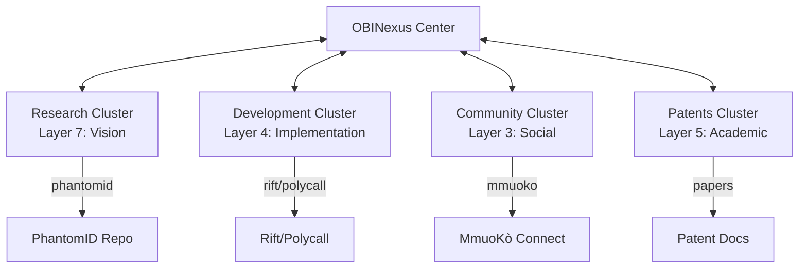

# 🔷 OBINexus MmuoKò Connect PageRank & Auto-Post System

## Complete Setup and Operations Guide

---

## 📋 Table of Contents

1. [Overview](#overview)
2. [System Architecture](#system-architecture)
3. [How It Works](#how-it-works)
4. [Installation](#installation)
5. [Auto-Posting System](#auto-posting-system)
6. [PageRank Algorithm](#pagerank-algorithm)
7. [Usage Examples](#usage-examples)
8. [Troubleshooting](#troubleshooting)
9. [API Reference](#api-reference)

---

## Overview

The **OBINexus MmuoKò Connect** system is a bidirectional PageRank-based social media routing platform that automatically distributes content across multiple platforms (GitHub, X/Twitter, TikTok) based on tonal analysis and network topology.

### 🎯 Core Goals

1. **Automated Content Distribution**: Posts are automatically scheduled and distributed
2. **Community-to-Center Ranking**: Content flows from community to OBINexus center and back
3. **Tonal Layer Integration**: 7 layers from Vision (Ọhụụ) to Foundation (Ntọala)
4. **PhantomID Verification**: All posts must achieve ≥0.954 coherence score
5. **#NoGhosting Policy**: Continuous engagement and presence maintenance

### 🔑 Key Components

```
obinexus/
├── obinexus-pagerank.py      # Bidirectional PageRank engine
├── mmuoko-connect-router.js  # Content routing system
├── autopost/
│   └── scheduler.py          # Automated posting daemon
├── .obinexus-rank            # Current rankings
└── mmuoko-connect.json       # System configuration
```

---

## System Architecture

### Network Topology



### Data Flow

1. **Content Creation** → 2. **Tonal Analysis** → 3. **PageRank Routing** → 4. **Platform Distribution** → 5. **Engagement Feedback** → 6. **Rank Update**

---

## How It Works

### 1. 📊 PageRank Computation

The system uses **bidirectional PageRank**:

- **Top-Down**: From OBINexus center to periphery (strategic guidance)
- **Bottom-Up**: From community nodes to center (grassroots feedback)
- **Harmonic**: Weighted combination based on tonal layers

```python
# Simplified algorithm
def compute_bidirectional_pagerank():
    # Standard PageRank (center-biased)
    top_down = pagerank(graph, personalization={center: 1.0})
    
    # Reverse PageRank (community-biased)
    reverse_graph = graph.reverse()
    bottom_up = pagerank(reverse_graph, personalization=community_nodes)
    
    # Harmonic combination
    harmonized = weighted_mean(top_down, bottom_up, tonal_weights)
    return harmonized
```

### 2. 🎵 Tonal Analysis

Each piece of content is analyzed across 7 tonal layers:

| Layer | Name | Igbo | Weight | Content Type |
|-------|------|------|--------|--------------|
| 7 | Vision | Ọhụụ | 2.0 | Strategic announcements |
| 6 | Philosophy | Nkà | 1.8 | Conceptual frameworks |
| 5 | Research | Nyocha | 1.6 | Academic papers, data |
| 4 | Development | Mmepe | 1.4 | Code releases, technical |
| 3 | Community | Obodo | 1.2 | Social engagement |
| 2 | Operations | Ọrụ | 1.0 | Status updates |
| 1 | Foundation | Ntọala | 0.8 | Infrastructure |

### 3. 🔄 Auto-Posting Process

```
[Content Queue] → [Scheduler Daemon] → [Router] → [Platforms]
                          ↑                            ↓
                    [PageRank Data] ← [Engagement Metrics]
```

---

## Installation

### Prerequisites

- Python 3.8+
- Node.js 14+
- Git
- Unix-like OS (Linux/Mac/WSL)

### Quick Setup

```bash
# 1. Clone and enter directory
cd ~/obinexus/workspace/mmuoko-connect/mmukorank-algorithm

# 2. Run the fixed setup script
chmod +x obinexus-setup-script.sh
./obinexus-setup-script.sh

# 3. Update your PATH
source ~/.bashrc

# 4. Verify installation
obinexus status
```

### Manual Setup

If the automatic setup fails:

```bash
# 1. Set environment variable
export OBINEXUS_PATH="$HOME/obinexus"

# 2. Create directory structure
mkdir -p $OBINEXUS_PATH/{workspace,autopost,clusters,manifests}
mkdir -p $OBINEXUS_PATH/autopost/{queue,sent,templates,logs}

# 3. Copy scripts
cp obinexus-pagerank.py $OBINEXUS_PATH/
cp mmuoko-connect-router.js $OBINEXUS_PATH/

# 4. Install Python dependencies
pip install --user networkx numpy requests GitPython

# 5. Install Node dependencies
npm install --prefix $OBINEXUS_PATH
```

---

## Auto-Posting System

### 🤖 How Auto-Posting Works

The auto-posting system continuously monitors for content, analyzes it, and distributes it based on PageRank priorities.

### Starting the Auto-Post Daemon

```bash
# Method 1: Using wrapper
obinexus start

# Method 2: Direct Python
python3 ~/obinexus/autopost/scheduler.py daemon

# Method 3: As systemd service (Linux)
sudo systemctl start obinexus-autopost
```

### Scheduling Posts

```bash
# Schedule immediate post
obinexus post

# Custom content with delay
echo '{"message": "Hello OBINexus!", "delay": 30}' | \
  python3 ~/obinexus/autopost/scheduler.py schedule
```

### Post Templates

Create templates in `~/obinexus/autopost/templates/`:

```json
{
  "name": "research_update",
  "tone": "high",
  "platforms": ["github", "x"],
  "template": "🔬 Research Update: {title}\n\n{content}\n\n#OBINexus #Research",
  "nsibidi": "◈⟠◈"
}
```

### Auto-Post Configuration

Edit `~/obinexus/autopost/config.json`:

```json
{
  "schedule": {
    "interval_minutes": 60,
    "peak_hours": [9, 12, 15, 18],
    "timezone": "UTC"
  },
  "platforms": {
    "x": {
      "enabled": true,
      "api_key": "YOUR_KEY",
      "max_length": 280
    },
    "github": {
      "enabled": true,
      "repo": "obinexus/updates"
    }
  },
  "content": {
    "min_coherence": 0.954,
    "require_phantomid": true,
    "tonal_preference": "harmonic"
  }
}
```

---

## PageRank Algorithm

### Bidirectional Computation

```python
# The algorithm performs three passes:

# 1. TOP-DOWN (Center → Community)
# Biased toward the center node
# Used for strategic content distribution

# 2. BOTTOM-UP (Community → Center)  
# Aggregates community signals
# Used for trending content detection

# 3. HARMONIC (Balanced)
# Weighted combination based on tonal layers
# Higher layers = more top-down weight
# Lower layers = more bottom-up weight
```

### Ranking Formula

```
Harmonized_Rank = α * TopDown + β * BottomUp + γ * Tonal
Where:
  α = 0.4 + 0.2 * (layer/7)  # Layer-dependent
  β = 0.4 - 0.2 * (layer/7)  # Inverse layer
  γ = 0.2                     # Constant tonal weight
```

### Coherence Score

Must maintain ≥0.954 for PhantomID compliance:

```
Coherence = 1.0 - (σ/μ)
Where:
  σ = standard deviation of ranks
  μ = mean of ranks
```

---

## Usage Examples

### 📝 Basic Commands

```bash
# Check system status
obinexus status

# Compute fresh PageRank
obinexus rank

# Schedule a post
obinexus post

# Sync all repositories
obinexus sync

# Start auto-posting
obinexus start
```

### 🚀 Advanced Usage

```bash
# Route specific content with tonal analysis
node ~/obinexus/mmuoko-connect-router.js route "PhantomID v2.0 Released!"

# Get content recommendations
node ~/obinexus/mmuoko-connect-router.js recommend

# Monitor real-time engagement
node ~/obinexus/mmuoko-connect-router.js monitor

# Analyze content tone
node ~/obinexus/mmuoko-connect-router.js analyze "Your content here"
```

### 🐍 Python API

```python
from pathlib import Path
import sys
sys.path.append(str(Path.home() / 'obinexus'))

from obinexus_pagerank import OBINexusPageRank

# Initialize
pagerank = OBINexusPageRank(base_path="~/obinexus")

# Scan repositories
repos = pagerank.scan_local_repos()

# Build graph
graph = pagerank.build_graph(repos)

# Compute rankings
top_down, bottom_up = pagerank.compute_bidirectional_pagerank()
harmonized = pagerank.harmonize_rankings(top_down, bottom_up, tonal)

# Generate manifest
manifest = pagerank.generate_mmuoko_manifest(harmonized)
```

---

## Troubleshooting

### Common Issues

#### Permission Denied
```bash
# If you see: mkdir: cannot create directory '/obinexus': Permission denied
# Solution: Use the fixed script that creates directories in $HOME/obinexus
./obinexus-setup-script.sh  # The fixed version
```

#### PageRank Not Computing
```bash
# Check Python dependencies
pip list | grep networkx

# Manually run PageRank
cd ~/obinexus
python3 obinexus-pagerank.py

# Check for errors in log
cat ~/obinexus/autopost/logs/error.log
```

#### Auto-Post Not Working
```bash
# Check if daemon is running
ps aux | grep scheduler.py

# Check queue
ls ~/obinexus/autopost/queue/

# Test posting manually
python3 ~/obinexus/autopost/scheduler.py post
```

### 📊 Monitoring

```bash
# View current rankings
cat ~/obinexus/.obinexus-rank | grep "rank ="

# Check coherence score
grep coherence ~/obinexus/.obinexus-rank

# Monitor auto-post logs
tail -f ~/obinexus/autopost/logs/scheduler.log
```

---

## API Reference

### REST Endpoints (when server is running)

```
POST   /api/rank              # Trigger PageRank computation
GET    /api/rankings          # Get current rankings
POST   /api/route             # Route content
GET    /api/recommendations  # Get content suggestions
POST   /api/schedule          # Schedule a post
GET    /api/queue            # View post queue
```

### WebSocket Events

```javascript
// Connect to monitoring
ws://localhost:8080/monitor

// Events
'ranking-update'    // New PageRank computed
'post-scheduled'    // Post added to queue
'post-sent'        // Post distributed
'engagement-update' // New engagement metrics
```

---

## 🎯 Mission-Critical Points

1. **Always maintain ≥0.954 coherence** for PhantomID
2. **Never forget the bidirectional flow**: Community ↔ Center
3. **Respect tonal layers** in content distribution
4. **Auto-posting is the goal**: Keep the daemon running
5. **#NoGhosting**: Continuous presence across platforms

---

## 📚 Additional Resources

- [OBINexus Constitution](https://github.com/obinexus/constitution)
- [PhantomID Documentation](https://github.com/obinexus/phantomid)
- [MmuoKò Studios](https://github.com/obinexus/mmuoko-studios)
- [Patent Portfolio](https://github.com/obinexus/patents)

---

## 🔷 Remember

> "When systems fail, build your own"  
> "Anchor Your Spirit - and I did just THAT!"

**The goal**: Automated, intelligent content distribution that maintains coherence while respecting the community-to-center bidirectional flow of the OBINexus network.

---

*OBINexus © 2025 - Building Infrastructure for Consciousness*