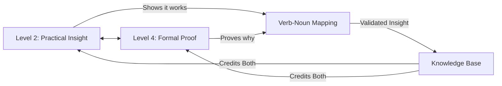

# Bidirectional Learning Framework
## OBINexus Education Reform Initiative

[](https://opensource.org/licenses/MIT)
[](https://github.com/obinexus/bidirectional-learning-framework)
[](https://github.com/obinexus/bidirectional-learning-framework)

> **"No teacher knows all until they prove it. Every student teaches something new."**

## Table of Contents

- [Why Traditional Education Fails](#why-traditional-education-fails)
- [The Bidirectional Solution](#the-bidirectional-solution)
- [Level Architecture](#level-architecture)
  - [Level 1: GCSE Foundation](#level-1-gcse-foundation)
  - [Level 2: Diploma & Functional Skills](#level-2-diploma--functional-skills)
  - [Level 3: Applied Bachelor's](#level-3-applied-bachelors)
  - [Level 4: Master's Professional](#level-4-masters-professional)
  - [Level 5: PhD Research](#level-5-phd-research)
- [Sector Coherence Model](#sector-coherence-model)
- [Implementation](#implementation)
- [Quick Start](#quick-start)
- [Documentation](#documentation)
- [Contributing](#contributing)
- [Vision Documents](#vision-documents)

## Why Traditional Education Fails

### The Unidirectional Problem

Traditional education operates on fundamentally flawed assumptions:

| Traditional Model (Broken) | Why It Fails | Human Cost |
|---------------------------|--------------|------------|
| **Teacher → Student only** | Assumes teacher omniscience | Stifles innovation from fresh perspectives |
| **Fixed progression paths** | Ignores lateral competence | Wastes talent that doesn't fit the mold |
| **Single-domain expertise** | Reality is interdisciplinary | Creates specialists who can't collaborate |
| **Grade-based validation** | Tests memorization, not understanding | Produces credentials without capability |
| **Hierarchical knowledge** | Senior = Smart (false) | Silences junior insights |
| **No doubt mechanism** | Certainty theater | Prevents genuine learning through uncertainty |

### The Crisis Points

```markdown
1. **Level 2 Gap Syndrome**
   - Student excels in computing (Level 3)
   - Struggles with arts fundamentals (Level 2)
   - System response: "You're failing"
   - Reality: Needs targeted support, not judgment

2. **The Expertise Paradox**
   - PhD holder misses obvious solution
   - Level 2 student sees it immediately  
   - System response: Ignore the student
   - Reality: Insight has no level requirement

3. **Language Barrier Dismissal**
   - Student: "It works when I do this thing"
   - Professor: "That's not academically rigorous"
   - System response: Reject informal knowledge
   - Reality: Working solution dismissed due to expression
```

## The Bidirectional Solution

### Core Principles

```yaml
bidirectional_learning:
  foundation:
    - doubt_migration: "Uncertainty flows both directions"
    - peer_validation: "Everyone validates everyone"
    - informal_insights: "Working > Formal proof"
    - lateral_entry: "#RightToAct through demonstration"
    
  knowledge_flow:
    Level_5_PhD ←→ Level_2_Student: true
    Senior ←→ Junior: true
    Expert ←→ Novice: true
    Formal ←→ Informal: true
    
  payment_structure:
    cross_checking: "Get paid to validate others"
    insight_capture: "Credited for discoveries"
    peer_review: "Compensated evaluation"
```

### How Bidirectional Learning Works



## Level Architecture

### Level 1: GCSE Foundation
**Entry:** Standard education or equivalent  
**Focus:** Fundamental literacy in chosen domain  
**Assessment:** Traditional examination + portfolio  
**Support:** Standard educational funding  
**Next:** Progress to Level 2 or demonstrate competence for lateral entry  

### Level 2: Diploma & Functional Skills
**Entry:** Level 1 completion OR demonstrated functional skills  
**Focus:** Sector specialization (Computing/Arts/Design Technology)  
**Key Feature:** This is where gaps are identified and supported  
**Support:** 
- ✅ Bursaries for gap areas
- ✅ Loans for continued education  
- ❌ NO grants at this level
**Next:** Apply knowledge practically to reach Level 3  

### Level 3: Applied Bachelor's
**Entry:** Level 2 completion OR portfolio demonstration  
**Focus:** Building real things that work  
**Example:** *"I build art websites using HTML/CSS/JS to display digital artwork"*  
**Support:**
- ✅ Project-specific grants NOW available
- ✅ Continued bursary support
- ✅ Loans for expansion
**Next:** Prove capability through peer review for Level 4  

### Level 4: Master's Professional
**Entry:** Level 3 + peer validation OR exceptional demonstration  
**Focus:** Leading projects with operational metrics  
**Requirements:**
- Must validate Level 2 insights
- Paid cross-checking responsibilities
- Formal proof capabilities
**Support:**
- ✅ Full project grants
- ✅ Tailored bursary support  
- ✅ Additional funding streams
- 💰 Income from peer review
**Next:** Original research contribution for Level 5  

### Level 5: PhD Research
**Entry:** Level 4 + published insights OR groundbreaking contribution  
**Focus:** Mathematical proof and new knowledge creation  
**Requirements:**
- Prove via QA mathematics
- Mentor lower levels
- Publish bidirectional insights
**Support:**
- ✅ Research grants
- ✅ Stipend for teaching
- 💰 Consulting opportunities
- 🌍 International collaboration (Japan cultural exchange)

## Sector Coherence Model

### Multi-Sector Competence Handling

```python
def assess_sector_coherence(student_profile):
    """
    Handle mixed-level expertise across sectors
    """
    gaps = identify_sector_gaps(student_profile)
    
    for sector, level in gaps.items():
        if level < required_level:
            support_package = {
                'sector': sector,
                'current_level': level,
                'support_type': 'bursary' if level == 2 else 'grant',
                'tailored': True,
                'reason': f"Level {level} gap in {sector} needs foundation support"
            }
            allocate_support(support_package)
    
    return generate_learning_path(student_profile, gaps)
```

## Implementation

### Quick Start

```bash
# Clone the repository
git clone https://github.com/obinexus/bidirectional-learning-framework.git
cd bidirectional-learning-framework

# Run the setup script
./complete_refactor.sh

# Check your level placement
./scripts/assess_level.sh --portfolio /path/to/work

# View sector coherence
./scripts/sector_coherence.sh --student-id YOUR_ID
```

### Core Scripts

| Script | Purpose | Usage |
|--------|---------|-------|
| `complete_refactor.sh` | Main framework setup | `./complete_refactor.sh` |
| `sector_coherence.sh` | Assess multi-sector gaps | `./sector_coherence.sh [student_id]` |
| `doubt_migration.py` | Handle insight validation | `python doubt_migration.py` |
| `terminal_language_barrier.js` | Resolve communication gaps | `node terminal_language_barrier.js` |

## Documentation

### Local Documentation
```bash
docs/
├── levels/           # Detailed level specifications
├── sectors/          # Sector-specific guidelines  
├── vision/           # V-documents and manifestos
└── examples/         # Real-world case studies
```

### Remote Resources
- 📚 [Full Documentation](https://github.com/obinexus/bidirectional-learning-framework/wiki)
- 🎯 [Level Assessments](https://github.com/obinexus/bidirectional-learning-framework/assessments)
- 💰 [Funding Guidelines](https://github.com/obinexus/bidirectional-learning-framework/funding)
- 🌏 [Japan Exchange Program](https://github.com/obinexus/bidirectional-learning-framework/cultural-exchange)

## Contributing

We welcome contributions from ALL levels:

### Level 2 Contributors
- Share practical insights that work (even if you can't prove why)
- Document "it works when I do this" discoveries
- Get credited for informal knowledge

### Level 4-5 Contributors  
- Validate and prove Level 2 insights
- Get paid for cross-checking
- Bridge language barriers through formal translation

### Contribution Process
```bash
1. Fork the repository
2. Create your feature branch (`git checkout -b insight/your-discovery`)
3. Document your insight (informal is OK!)
4. Submit PR with description
5. Participate in bidirectional review
6. Get credited (and potentially paid!)
```

## Vision Documents

### V/ - Anti-Bureaucracy Manifesto

Our education reform rejects:
- ❌ Permission-based learning
- ❌ Hierarchical knowledge gatekeeping  
- ❌ Single-path progression
- ❌ Dismissal of informal insights

We embrace:
- ✅ Right to Act (#RightToAct)
- ✅ Lateral entry through demonstration
- ✅ Doubt as learning mechanism
- ✅ Payment for validation work
- ✅ No teacher knows all (until proven)

### Japan Cultural Exchange
After Level 4-5 achievement, participants eligible for:
- Tokyo innovation centers
- Fukushima reconstruction projects  
- Nagasaki peace education
- Rural innovation initiatives
- "Making my breath" - understanding patience in learning

## Tags

`#bidirectional-learning` `#education-reform` `#doubt-migration` `#peer-validation`
`#level-progression` `#sector-coherence` `#informal-insights` `#paid-review`
`#right-to-act` `#no-teacher-knows-all` `#obinexus-education` `#verb-noun-mapping`
`#terminal-language-barrier` `#japan-exchange` `#anti-bureaucracy` `#working-solutions`
`#level2-insights` `#phd-humility` `#practical-knowledge` `#formal-proof`

---

**"Education is not about knowing everything. It's about learning from everyone."**

*OBINexus Education Reform Initiative - Where insights flow both ways*