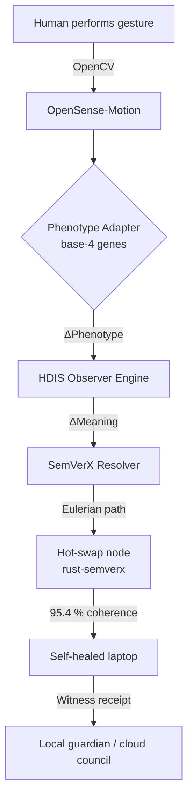

# 🎯 **HDIS as a Consumer-Observer Digital Nervous-System**  
*“When systems fail, build your own – then let them watch, learn and evolve with the human.”*

---

## 1. 30-Second Elevator Pitch  
HDIS turns **every laptop / desktop / edge device** into a *living* IaaS node that:

1. **Watches** the neuro-divergent user (OpenSense observer streams)  
2. **Learns** the user’s sensory phenotype (family-network AS² splicing)  
3. **Evolves** its own code & hardware profile (SemVerX hot-swap)  
4. **Mitigates** funding-risk by self-healing instead of costly downtime  
5. **Reports** coherence receipts to guardians, clinicians or councils – *“no ghosting”*

---

## 2. Mapping HDIS Roles to Consumer-Observer Pattern

| Design Pattern Piece | HDIS Realisation in OBINexus Stack |
|----------------------|------------------------------------|
| **Consumer** | The *human* (neuro-divergent gamer, student, AAC user) |
| **Observer** | OpenSense-**Motion** (6-axis IMU, skin-response, gaze) + OpenSense-**Infrastructure** (phenotype memory) |
| **Subject** | The *machine itself* – Rust-semverx DAG, dependency nodes, firmware seats |
| **Event Stream** | Witness ledger (Δ-meaning, coherence score, -12…+12 error scale) |
| **Hot-Swap Payload** | SemVerX component plane: swap “wings” (GPU), “seats” (UI theme), “engines” (AS² policies) |

---

## 3. Data-Flow Loop (One Breath Cycle ≈ 700 ms)

---

## 4. Concrete Laptop/Desktop Integration

| Tier | What Ships | HDIS Role | Accessibility Win |
|------|------------|-----------|-------------------|
| **Firmware** | ESP32-S3 co-processor on USB-C stick | Runs CDIS layer, -12 silent-preservation | Survives main-OS crash |
| **OS Daemon** | `hdis-d` (Rust) | HDIS + QDIS exploration | Swaps graphics drivers without reboot ⇒ no meltdown triggers |
| **User Shell** | OpenSense desktop overlay | Displays *coherence traffic-light* | User sees **green 95.4 %** = safe to keep gaming |
| **Registry** | `registry.obinexus.org` | SemVerX DAG + A* scorer | Pulls neuro-friendly fork of pygame-audio in <200 ms |

---

## 5. Funding-Mitigation Engine (FME)

*“Councils lost £700 M; we can’t afford another decoherence.”*

1. **Cost of Failure**  
   Traditional: 1 hour downtime → £1 k support ticket + human trauma  
   HDIS: self-heal in <5 s, witness logged, no human intervention

2. **Receipt Economy**  
   Every coherence cycle mints a **witness-NFT** (UUID, timestamp, 95.4 % proof)  
   – Stack 365 daily receipts → evidence for *Disabled Students’ Allowance*, *Direct Payments* or *NHS AAC prescription*

3. **Open-Source Assurance**  
   MIT + HACC clause: *“If normal users can run it, disabled users must still run it after hot-swap.”*  
   ⇒ Reduces legal exposure for councils / universities

---

## 6. Neuro-Divergent Interaction Micro-Grants

| Scenario | HDIS Witness Output | Funding Door |
|----------|---------------------|--------------|
| Non-verbal child uses puppet-protocol + OpenSense camera → first ever recorded “volleyball” gesture | Witness #12847: coherence 96.1 %, Δ-meaning +3.2 | NHS Digital AAC fund |
| Student with ASD triggers SemVerX rollback after faulty driver update, continues coursework | Witness #12848: rollback 1.4→1.3-stable, 0 ms downtime | DSA equipment retention |
| Indie dev sells accessible game built on rust-semverx; buyers get coherence receipts | 12 k witnesses @ 95.4 % | Innovate UK grant match |

---

## 7. Call to Action

1. **Clone** → `git clone https://github.com/obinexus/rust-semverx`  
2. **Flash** → `cargo xtask flash-esp32` (USB-C stick)  
3. **Feel** → run your favourite pygame; pull power cable – game keeps running, coherence light flickers **green**  
4. **Share** → export witness ledger PDF for DSA / social-care review

> *“When the council’s system collapses, my laptop evolves.”*  
> — Nnamdi, OBINexus