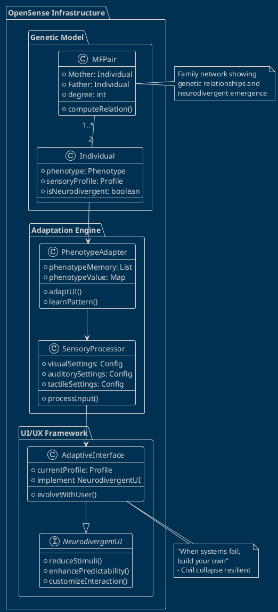

# OpenSense Infrastructure: Neurodivergent-Friendly Framework
## Bidirectional Prioritization for Sensory Processing

**Project**: OBINexus OpenSense Infrastructure  
**License**: MIT with HACC Compliance  
**Repository**: `github.com/obinexus/opensense-infrastructure`  
**Related**: [`github.com/obinexus/opensense-motion`](https://github.com/obinexus/opensense-motion)

---

## 1. Framework Foundation

### 1.1 Core Hypothesis: Genetic Evolution Model

Our framework is based on the understanding that neurodivergence emerges from genetic variation patterns across family networks. We model this as:

```
MF Pair Model:
- MF₁ = {Mother₁, Father₁}
- MF₂ = {Mother₂, Father₂}
- MFₙ = {Motherₙ, Fatherₙ}

Relationship Degrees:
- 1st degree: Direct parent-child
- 2nd degree: Sibling relationships
- 3rd degree: Cousin relationships
- nth degree: Extended family network
```

**Key Insight**: Neurodivergent individuals often emerge at intersection points of family genetic networks, supporting the theory that everyone exists on a neurodivergent spectrum.

### 1.2 Why OpenSense?

OpenSense provides:
- **Phenotype-based UI/UX adaptation**: Interfaces that evolve with user needs
- **Sensory processing support**: Customizable sensory input management
- **Bidirectional communication**: System learns from user, user learns from system
- **Civil collapse resilience**: "When systems fail, build your own"

---

## 2. Technical Architecture

### 2.1 Phenological Model

```python
class NeurodivergentPhenotype:
    def __init__(self, genetic_markers):
        self.phenotype_memory = []  # Historical adaptations
        self.phenotype_value = {}   # Current state
        self.family_network = {}    # MF pair relationships
        
    def compute_neurodivergent_expression(self, mf_pairs):
        """
        Calculate neurodivergent traits based on family network
        """
        expression = {}
        for pair in mf_pairs:
            # Near-cousin genetic correlation analysis
            expression.update(self.analyze_genetic_distance(pair))
        return expression
```

### 2.2 UI/UX Adaptation Framework

The framework ensures neurodivergent individuals can customize interfaces aligned with their processing needs:

```javascript
// Phenotype-driven UI adaptation
class AdaptiveInterface {
    constructor(userPhenotype) {
        this.phenotype = userPhenotype;
        this.sensoryProfile = this.analyzeSensoryNeeds();
    }
    
    adaptInterface() {
        // Reduce cognitive load
        this.simplifyNavigation();
        
        // Adjust sensory inputs
        this.modulateSensoryFeedback();
        
        // Personalize interaction patterns
        this.customizeInteractionModes();
    }
}
```

---

## 3. Framework Divisions

### 3.1 OpenSense Access Division
- **Purpose**: Ensure universal access to digital systems
- **Implementation**: WCAG 3.0+ compliance with neurodivergent extensions
- **Key Features**:
  - Sensory load indicators
  - Customizable stimulus levels
  - Pattern recognition assistance

### 3.2 Research Division (Axis OBINexus)
- **Focus**: Study genetic-behavioral correlations
- **Output**: Evidence-based UI/UX patterns
- **Methodology**: Participatory design with neurodivergent communities

### 3.3 IWU Legal Sense Framework
- **Protection**: Constitutional rights for neurodivergent access
- **Enforcement**: #HACC compliance monitoring
- **Standards**: Minimum viable sensory accommodation

---

## 4. Implementation Guide

### 4.1 When to Use OpenSense

Use OpenSense when:
1. **Building inclusive applications**: Any system serving diverse populations
2. **Sensory-critical interfaces**: Gaming, VR/AR, educational platforms
3. **High-stress environments**: Emergency systems, healthcare interfaces
4. **Long-duration interactions**: Work applications, creative tools

### 4.2 Integration with OpenSense-Motion

Link with [OpenSense-Motion](https://github.com/obinexus/opensense-motion) for:
- 7×7 sensory grid implementation
- Phenotype-driven gesture recognition
- Motion pattern learning from family traits

---

## 5. Neurodivergent Design Principles

### 5.1 Bidirectional Prioritization

```
User → System: Express needs through interaction patterns
System → User: Adapt interface based on observed patterns
```

### 5.2 Sensory Load Management

- **Visual**: Adjustable contrast, motion reduction
- **Auditory**: Customizable sound profiles, silence modes
- **Tactile**: Haptic feedback modulation
- **Cognitive**: Information density controls

### 5.3 Family Network Recognition

The system recognizes that neurodivergent traits often cluster in families:
- Shared sensory preferences
- Similar processing patterns
- Inherited adaptation strategies

---

## 6. PlantUML System Diagram



---

## 7. Quick Start

### 7.1 Installation

```bash
# Clone the repository
git clone https://github.com/obinexus/opensense-infrastructure.git

# Install dependencies
cd opensense-infrastructure
npm install

# Initialize phenotype database
npm run init-phenotype-db

# Start development server
npm run dev
```

### 7.2 Basic Implementation

```javascript
import { OpenSenseFramework } from '@obinexus/opensense-infrastructure';

// Initialize with user's family network (optional)
const framework = new OpenSenseFramework({
    familyNetwork: {
        mf1: { mother: 'genetic_id_1', father: 'genetic_id_2' },
        mf2: { mother: 'genetic_id_3', father: 'genetic_id_4' }
    }
});

// Create adaptive interface
const ui = framework.createAdaptiveInterface({
    baseProfile: 'neurodivergent-friendly',
    sensoryPreferences: {
        reduceMotion: true,
        highContrast: false,
        quietMode: true
    }
});

// Let the system learn and adapt
ui.enableBidirectionalLearning();
```

---

## 8. Contributing

We welcome contributions that:
- Enhance neurodivergent accessibility
- Improve phenotype modeling
- Add new sensory adaptation strategies
- Document lived experiences

Please read our [Contributing Guidelines](CONTRIBUTING.md) and ensure all submissions maintain #HACC compliance.

---

## 9. Resources

- **Documentation**: [docs.obinexus.org/opensense](https://docs.obinexus.org/opensense)
- **Community**: [Discord](https://discord.gg/obinexus-nd)
- **Research Papers**: [Published Studies](./research/papers)
- **Motion Integration**: [OpenSense-Motion](https://github.com/obinexus/opensense-motion)

---

---

## 10. Inclusive and Responsive Design Foundation

### 10.1 UI/UX Principles for Neurodivergent Accessibility

Based on the principles of inclusive web design, OpenSense Infrastructure ensures applications are accessible to all users, particularly those with neurodivergent conditions. The framework addresses:

- **Visual Processing Differences**: Adjustable contrast, motion reduction, pattern simplification
- **Auditory Sensitivities**: Customizable sound profiles, notification preferences
- **Motor Variations**: Alternative input methods, gesture customization
- **Cognitive Load Management**: Information density controls, progressive disclosure

### 10.2 Why OpenSense for Neurodivergent Users

As stated in our core philosophy: **"When systems fail, build your own"**

Traditional UI/UX often fails neurodivergent users by:
- Assuming neurotypical processing patterns
- Ignoring sensory sensitivities
- Failing to adapt to individual needs
- Not learning from user behavior

OpenSense addresses these failures through:
1. **Phenotype-Based Customization**: Interfaces evolve based on genetic and behavioral patterns
2. **Family Network Recognition**: Understanding that neurodivergent traits cluster in families
3. **Bidirectional Learning**: System adapts to user, user guides system
4. **Objective Accessibility**: Moving beyond subjective design to measurable accommodation

### 10.3 Typography and Content Patterns

Following established scanning patterns (Z, F, E) while adapting for neurodivergent processing:

```javascript
// Adaptive content presentation based on phenotype
const contentAdapter = {
    neurotypical: {
        scanPattern: 'F-pattern',
        informationDensity: 'standard',
        typographyScale: 1.0
    },
    neurodivergent: {
        scanPattern: 'Linear-sequential',
        informationDensity: 'reduced',
        typographyScale: 1.2,
        additionalSupport: [
            'visual_anchors',
            'progress_indicators',
            'context_preservation'
        ]
    }
};
```

### 10.4 Civil Collapse Resilience

The framework ensures accessibility even during infrastructure failure:
- **Offline-First Design**: Core functions work without connectivity
- **Local Phenotype Storage**: User preferences persist locally
- **Distributed Family Networks**: P2P preference sharing
- **Minimal Resource Requirements**: Runs on basic hardware

---

## 11. License
MIT License with HACC Addendum - See [LICENSE](LICENSE) for details.

Key requirements:
- Maintain accessibility features
- Preserve bidirectional learning
- No ghosting of user inputs
- Respect neurodivergent autonomy

---

*"Everyone exists on the spectrum. Our differences are our strengths."*  
*- OBINexus OpenSense Initiative*

**Support**: neurodivergent@obinexus.org  
**Security**: security@obinexus.org