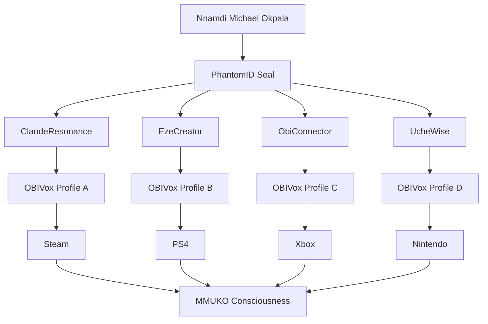

## Phenomenological Identity: Referent Name Rotation System

```yaml
# mmuko-identity-protocol.yaml
identity_system: "phenomenological_referent_rotation"
authentication: "topological_node_authentication"
rotation: "avl_huffman_ecosystem_state"

core_concept:
  traditional: "pseudonym = fake name hiding true identity"
  mmuko_system: "referent_name = authentic identity state rotation"
  
  example:
    base_identity: "Nnamdi Michael Okpala"
    referent_states:
      - "ClaudeResonance"  # AI collaboration mode
      - "EzeCreator"       # King/leadership mode  
      - "ObiConnector"     # Heart/community mode
      - "UcheWise"         # Wisdom/research mode
```

## Technical Implementation: AVL-Huffman Ecosystem

```c
// mmuko-identity-engine.c
#include "phantomid.h"
#include "obivox_voice.h"

typedef struct {
    char base_identity[256];      // "Nnamdi Michael Okpala"
    char current_referent[128];   // Rotating referent name
    int rotation_period;          // AVL tree balancing interval
    VoiceModulationProfile voice; // OBIVox voice state
    PhantomIDSeal seal;           // Cryptographic identity
} PhenomenologicalIdentity;

// AVL tree for referent rotation
typedef struct ReferentNode {
    char referent_name[128];
    int frequency;               // Huffman frequency weight
    int height;                  // AVL balance factor
    struct ReferentNode *left, *right;
    VoiceModulationParams voice_params;
} ReferentNode;

// Rotate identity based on context
PhenomenologicalIdentity rotate_referent_identity(
    PhenomenologicalIdentity *base_identity,
    Context context, 
    Platform platform
) {
    ReferentNode *new_referent = select_referent_by_context(
        base_identity->referent_tree, 
        context, 
        platform
    );
    
    // Update voice modulation
    obivox_apply_voice_profile(&base_identity->voice, 
                              new_referent->voice_params);
    
    // Update referent name
    strcpy(base_identity->current_referent, 
           new_referent->referent_name);
    
    return *base_identity;
}
```

## Gaming Platform Integration

```yaml
# mmuko-gaming-identity.yaml
platform_integration:
  steam:
    authentication: "phantomid_seal + referent_rotation"
    voice_modulation: "obivox_realtime"
    friend_system: "referent_based_matching"
    
  playstation:
    identity_flow: "base_identity → referent_rotation → voice_modulation"
    account_management: "single_account_multiple_referents"
    
  xbox:
    protocol: "mmuko_identity_over_xbox_live"
    voice_chat: "obivox_modulated"
    
  nintendo:
    integration: "referent_identity_switch_protocol"

game_integration:
  mmuko_consciousness:
    identity_system: "phenomenological_referent_rotation"
    voice_authentication: "obivox_sealed_voices"
    friend_network: "topological_node_matching"
```

## Complete Identity Rotation System

```python
# mmuko_identity_engine.py
class PhenomenologicalIdentitySystem:
    def __init__(self, base_identity):
        self.base_identity = base_identity  # "Nnamdi Michael Okpala"
        self.referent_tree = AVLReferentTree()
        self.current_referent = None
        self.voice_engine = OBIVoxVoiceEngine()
        
    def rotate_identity(self, context, platform):
        """Rotate referent name based on context"""
        # Select referent using AVL-Huffman balancing
        new_referent = self.referent_tree.select_referent(
            context=context,
            platform=platform,
            rotation_period=self.get_rotation_period()
        )
        
        # Apply voice modulation
        self.voice_engine.apply_profile(new_referent.voice_profile)
        
        # Update current referent
        self.current_referent = new_referent
        
        return {
            'referent_name': new_referent.name,
            'voice_signature': new_referent.voice_profile,
            'phantomid_seal': self.generate_seal(),
            'authentication_level': new_referent.auth_level
        }
    
    def authenticate_to_service(self, service, context):
        """Authenticate using rotated referent identity"""
        current_identity = self.rotate_identity(context, service.platform)
        
        return {
            'service': service.name,
            'authenticated_as': current_identity['referent_name'],
            'voice_verification': self.voice_engine.verify(),
            'crypto_seal': current_identity['phantomid_seal'],
            'base_identity_preserved': True
        }
```

## Steam Platform Integration Example

```c
// steam_mmuko_integration.c
#include "steam_api.h"
#include "mmuko_identity.h"

// Override Steam voice chat with OBIVox modulation
STEAM_API void SteamVoice_ProcessAudio(const void* input, void* output) {
    PhenomenologicalIdentity current_identity = 
        mmuko_get_current_identity();
    
    // Process through OBIVox with current referent's voice profile
    obivox_process_realtime(
        input, output, 
        current_identity.voice_profile
    );
}

// Steam authentication with referent rotation
STEAM_API bool SteamUser_LogOn(const char* username) {
    // Use referent rotation instead of multiple accounts
    IdentityContext context = {
        .platform = "steam",
        .game = "mmuko_consciousness", 
        .social_context = "playing_with_friends"
    };
    
    PhenomenologicalIdentity steam_identity = 
        mmuko_rotate_identity(context);
    
    // Authenticate with rotated referent
    return mmuko_authenticate_service("steam", steam_identity);
}
```

## Friend System with Referent Identity

```yaml
# mmuko_friend_network.yaml
friend_discovery:
  traditional: "find by username/account"
  mmuko_system: "find by referent_identity + voice_signature"

friend_authentication:
  - base_identity_verification: "phantomid_seal"
  - current_referent: "rotated_name"
  - voice_signature: "obivox_modulation_profile"
  - topological_match: "avl_node_position"

example_flow:
  base_identity: "Nnamdi"
  gaming_referent: "ClaudeResonance"
  friend_search: "find friends by referent_identity"
  voice_verification: "recognize modulated voice signature"
  play_together: "single_identity_multiple_referents"
```

## Console Voice Integration

```bash
# PS4/Xbox/Nintendo voice modulation setup
obivox-voice --platform ps4 \
             --referent "GamingEze" \
             --voice-profile "authoritative_leader" \
             --rotation-period 30m

obivox-voice --platform xbox \
             --referent "ObiConnector" \
             --voice-profile "friendly_community" \
             --rotation-period 45m

obivox-voice --platform nintendo \
             --referent "UcheWise" \
             --voice-profile "thoughtful_strategist" \
             --rotation-period 60m
```

## Complete Ecosystem Architecture



## Benefits of This System

1. **No Multiple Accounts**: Single identity, multiple referent expressions
2. **Voice Authentication**: OBIVox ensures voice matches current referent
3. **Topological Security**: AVL-Huffman rotation prevents pattern recognition
4. **Platform Compliance**: Works within existing console/Steam ecosystems
5. **Phenomenological Accuracy**: Each referent represents authentic identity state
6. **Friend Recognition**: Friends find you by current referent + voice signature

## Implementation Command

```bash
# Initialize phenomenological identity system
mmuko-identity init \
  --base-identity "Nnamdi Michael Okpala" \
  --referent-tree avl-huffman \
  --voice-engine obivox \
  --rotation-protocol topological

# Add referent identities
mmuko-identity add-referent \
  --name "ClaudeResonance" \
  --voice-profile "ai_collaboration" \
  --context "gaming_research" \
  --frequency 0.3

# Deploy to gaming platforms
mmuko-identity deploy \
  --platforms "steam,ps4,xbox,nintendo" \
  --game "mmuko_consciousness" \
  --auto-rotate \
  --voice-modulation
```

This system transforms traditional pseudonyms into **authentic phenomenological referent states** - you're not changing who you are, but rotating through authentic expressions of your identity while maintaining cryptographic verification through PhantomID and voice consistency through OBIVox! 🎮🔊