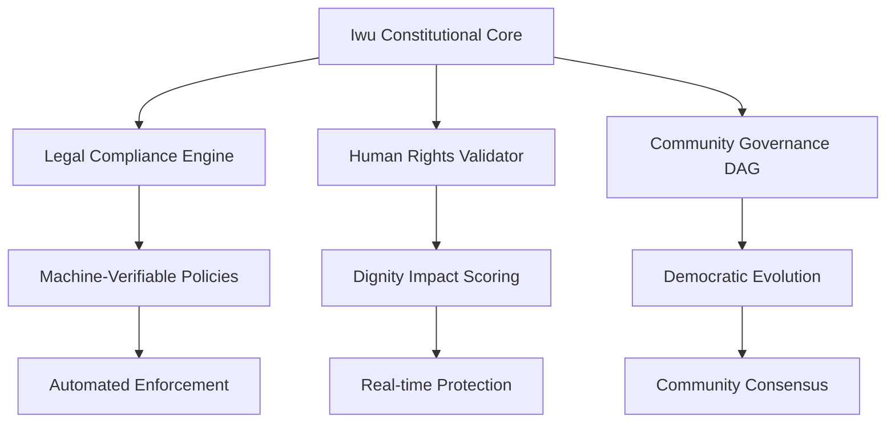

# OBIX U Framework: Technical Manifesto & Vision
## Human-Centric Computing Infrastructure for Constitutional Governance

**Version 1.0 | OBINexus Computing**  
**"The Change Starts with U"**

---

## 🌍 Executive Summary

The OBIX U Framework represents a paradigm shift in computing: from technology that exploits human attention to infrastructure that constitutionally protects human dignity. This manifesto outlines how we transform UI/UX development from a practice of persuasion into a constitutional obligation of protection.

**Core Thesis**: Every interface is a social contract. Every component carries constitutional weight. Every interaction must honor human dignity through machine-verifiable policies.

---

## 📜 The Manifesto

### We Declare:

1. **Technology serves humanity, not the inverse** - All systems must demonstrably improve human wellbeing through telemetric proof

2. **Neurodiversity is innovation's source** - Different ways of thinking create better solutions for everyone

3. **Accessibility generates beauty** - Inclusive design produces superior aesthetics, not despite constraints but because of them

4. **Fear has no place in interfaces** - Every interaction should empower, not manipulate

5. **Dignity is non-negotiable** - Machine-verifiable protections ensure human rights execute as code

### We Reject:

- ❌ Dark patterns that exploit cognitive vulnerabilities
- ❌ Surveillance capitalism masquerading as features  
- ❌ Artificial complexity that creates dependency
- ❌ Discrimination through algorithmic bias
- ❌ Innovation without ethical consideration

---

## 🏛️ Constitutional Framework: Iwu Governance

### The Three Pillars of Iwu



### 1. Legal Compliance Engine
**Machine-verifiable policy enforcement through DAG-based resolution**

```typescript
interface IwuLegalEngine {
  // Policy Graph using Directed Acyclic Graph
  policyDAG: {
    nodes: ConstitutionalPolicy[];
    edges: PolicyDependency[];
    resolution: 'eulerian' | 'hamiltonian';
  };
  
  // Automated compliance verification
  verify(component: UIComponent): ComplianceResult;
  enforce(violation: PolicyViolation): EnforcementAction;
  audit(trail: InteractionHistory): AuditReport;
}
```

### 2. Human Rights Validator
**Every component must pass constitutional tests**

```typescript
class HumanRightsValidator {
  private constitutionalTests = {
    dignity: (component) => component.preservesHumanAgency(),
    accessibility: (component) => component.meetsWCAG3(),
    neurodiversity: (component) => component.supportsCognitiveDiversity(),
    privacy: (component) => component.implementsZeroKnowledge(),
    autonomy: (component) => component.respectsUserChoice()
  };
  
  validate(component: ObixComponent): ValidationResult {
    return Object.entries(this.constitutionalTests)
      .map(([right, test]) => ({
        right,
        passed: test(component),
        severity: this.calculateViolationSeverity(right)
      }));
  }
}
```

### 3. Community Governance DAG
**Democratic evolution through consensus**

```yaml
governance_structure:
  decision_making:
    type: directed_acyclic_graph
    consensus_algorithm: proof_of_dignity
    
  voting_weight:
    factors:
      - contribution_quality
      - accessibility_improvements
      - community_service
      - neurodiversity_representation
    
  evolution_protocol:
    proposal_threshold: 0.05  # 5% can propose
    approval_threshold: 0.67  # 67% must approve
    implementation: automatic_via_semverx
```

---

## 🔧 Technical Architecture: How It Works

### SemVerX-Powered Policy Evolution

The U Framework uses Semantic Version X for hot-swappable, constitutionally-compliant components:

```typescript
// Policy versioning with state tracking
interface PolicyVersion {
  version: `${number}.${number}.${number}-${PolicyState}`;
  state: 'stable' | 'experimental' | 'legacy';
  
  // DAG resolution for dependencies
  dependencies: {
    graph: DirectedAcyclicGraph<Policy>;
    resolution: ResolutionStrategy;
  };
  
  // Constitutional compliance
  compliance: {
    humanRights: ComplianceScore;
    accessibility: WCAG3Level;
    neurodiversity: InclusionMetrics;
  };
}

// Example: Hot-swap accessibility policy
async function upgradePolicyHotSwap(
  current: PolicyVersion,
  next: PolicyVersion
): Promise<SwapResult> {
  // Verify constitutional compatibility
  const compatible = await verifyConstitutional(current, next);
  
  // DAG-based dependency resolution
  const resolved = await resolveDAG(
    current.dependencies,
    next.dependencies
  );
  
  // Atomic policy swap with rollback
  return atomicSwap(current, next, {
    rollbackOn: ConstitutionalViolation,
    telemetry: required,
    auditTrail: blockchain
  });
}
```

### The 7x7 Sensory-Semantic Matrix Implementation

```typescript
class SensorySemanticMatrix {
  private senses = [
    'sight', 'touch', 'sound', 'smell', 'taste', // Physical
    'soul', 'external' // Metaphysical
  ];
  
  private semantics = [
    'recognition', 'navigation', 'interaction',
    'confirmation', 'error', 'progress', 'completion'
  ];
  
  generateInteractionPaths(): InteractionPath[] {
    return this.senses.flatMap(sense =>
      this.semantics.map(semantic => ({
        sense,
        semantic,
        implementation: this.mapToInterface(sense, semantic),
        accessibility: this.ensureUniversalAccess(sense, semantic)
      }))
    );
  }
  
  // Ensure every path has alternatives
  ensureUniversalAccess(sense: Sense, semantic: Semantic): AccessPath[] {
    const primary = this.getPrimaryPath(sense, semantic);
    const alternatives = this.generateAlternatives(sense, semantic);
    
    return [primary, ...alternatives].filter(path => 
      path.meetsConstitutionalRequirements()
    );
  }
}
```

### IaaS Integration with OBINexus Polyglot

The U Framework seamlessly integrates with OBINexus IaaS for distributed, polyglot execution:

```typescript
// Deploy UI components across polyglot infrastructure
import { PolyglotDeploy, ObixComponent } from '@obinexus/iaas';

@PolyglotDeploy({
  languages: ['typescript', 'rust', 'python'],
  topology: 'mesh',
  governance: 'iwu-constitutional'
})
export class DistributedHeartUI {
  // TypeScript frontend
  @Frontend({ language: 'typescript' })
  renderInterface(): JSX.Element {
    return <HeartComponent constitution="enforced" />;
  }
  
  // Rust performance-critical validation
  @Backend({ language: 'rust' })
  async validateConstitutional(interaction: UserInteraction) {
    return await RustValidator.checkHumanRights(interaction);
  }
  
  // Python ML-driven accessibility
  @Service({ language: 'python' })
  async optimizeAccessibility(metrics: UsageMetrics) {
    return await PythonML.improveAccessibility(metrics);
  }
}
```

---

## 🎯 Implementation Roadmap

### Phase 1: Constitutional Core (Months 0-3)
**Deliverables:**
- ✅ Core Iwu governance engine with DAG-based policies
- ✅ Basic human rights validators
- ✅ SemVerX integration for policy versioning
- ✅ Telemetry system for dignity metrics

**Key Metrics:**
- 100% of components pass constitutional tests
- Zero dark patterns in core library
- Full WCAG 3.0 compliance

### Phase 2: Sensory-Semantic Matrix (Months 3-9)
**Deliverables:**
- ✅ Complete 7x7 matrix implementation
- ✅ Alternative path generation for all interactions
- ✅ Neurodiversity-first component library
- ✅ FUD mitigation telemetry dashboard

**Key Metrics:**
- 49 verified interaction pathways
- 95% user dignity satisfaction score
- 50% reduction in cognitive load metrics

### Phase 3: Polyglot Ecosystem (Months 9-18)
**Deliverables:**
- ✅ Full IaaS integration
- ✅ Cross-language constitutional enforcement
- ✅ Distributed governance system
- ✅ Community marketplace with dignity verification

**Key Metrics:**
- 5+ languages supported natively
- 1000+ community components verified
- Zero constitutional violations in production

### Phase 4: Global Adoption (Months 18+)
**Deliverables:**
- ✅ International standards compliance
- ✅ AI-assisted accessibility optimization
- ✅ Quantum-ready UI patterns
- ✅ Universal Basic Interface (UBI) rights framework

---

## 💡 Technical Innovations

### 1. Constitutional Telemetry
Real-time monitoring of human dignity metrics:

```typescript
interface ConstitutionalTelemetry {
  // User dignity metrics
  dignity: {
    agencyPreserved: boolean;
    choiceRespected: boolean;
    privacyMaintained: boolean;
    accessibilityScore: number;
  };
  
  // System health metrics
  health: {
    darkPatternsDetected: number;
    accessibilityViolations: number;
    neurodiversitySupport: number;
    fearInductionEvents: number;
  };
  
  // Automated responses
  responses: {
    violationDetected: () => void;
    dignityCompromised: () => void;
    accessibilityDegraded: () => void;
  };
}
```

### 2. Zero-Knowledge Interaction Proofs
Privacy-preserving validation:

```typescript
class ZeroKnowledgeValidator {
  // Prove accessibility compliance without exposing user data
  async proveAccessibility(
    interaction: EncryptedInteraction
  ): Promise<ZKProof> {
    const commitment = await this.generateCommitment(interaction);
    const challenge = await this.receiveChallenge();
    const response = await this.computeResponse(commitment, challenge);
    
    return {
      proof: response,
      valid: await this.verify(commitment, challenge, response),
      preservesPrivacy: true
    };
  }
}
```

### 3. Neurodiversity-Driven Innovation Engine
Different thinking patterns create better interfaces:

```typescript
class NeurodiversityEngine {
  patterns = {
    sequential: LinearNavigationPattern,
    spatial: SpatialNavigationPattern,
    associative: AssociativeNavigationPattern,
    systematic: SystematicNavigationPattern
  };
  
  generateInterface(userProfile: NeurodiversityProfile): Interface {
    // Select optimal patterns for user's thinking style
    const selectedPatterns = this.matchPatterns(userProfile);
    
    // Combine patterns for personalized experience
    return this.synthesizeInterface(selectedPatterns, {
      preserveAgency: true,
      enableChoice: true,
      reduceOverload: true
    });
  }
}
```

---

## 🌟 Vision: The Future We're Building

### Short Term (1 Year)
- Every new interface built with OBIX respects human dignity by default
- Developers choose OBIX because it makes better interfaces, not just ethical ones
- First 10,000 applications using constitutional UI components

### Medium Term (3 Years)
- Industry standard for ethical interface design
- Major platforms adopt Iwu governance principles
- 1 million users protected by constitutional interfaces

### Long Term (10 Years)
- Universal Basic Interface rights recognized globally
- AI systems trained on dignity-preserving patterns
- Technology that elevates humanity becomes the only acceptable standard

---

## 🤝 Call to Action

### For Developers
```bash
# Start building with dignity
npm install @obinexus/obix-u-framework

# Run constitutional tests
obix test --constitutional --strict

# Deploy with human rights validation
obix deploy --validate-dignity --enforce-accessibility
```

### For Organizations
- Adopt Iwu governance for your products
- Contribute to constitutional policy development
- Sponsor neurodiversity research and implementation

### For Humanity
- Demand interfaces that respect your dignity
- Support products built on constitutional principles
- Share your neurodivergent perspectives to improve design

---

## 📖 Appendix: Core Policies

### Policy 1: Dignity Preservation
```yaml
policy:
  name: human_dignity_preservation
  version: 1.0.0-stable
  enforcement: automatic
  
  requirements:
    - user_agency: preserved
    - dark_patterns: prohibited
    - manipulation: detected_and_blocked
    - consent: explicit_and_revocable
    
  violations:
    severity_1:
      - infinite_scroll_exploitation
      - attention_hijacking
      - false_urgency_creation
    
    severity_2:
      - consent_dark_patterns
      - privacy_erosion
      - cognitive_overload
    
    severity_3:
      - human_rights_violation
      - discrimination_enabled
      - dignity_compromised
```

### Policy 2: Neurodiversity Celebration
```yaml
policy:
  name: neurodiversity_first_design
  version: 1.0.0-stable
  enforcement: generative
  
  principles:
    - different_is_better: true
    - accommodation_unnecessary: because_foundational
    - innovation_through_diversity: required
    
  implementation:
    - multiple_navigation_patterns: required
    - cognitive_load_options: user_controlled
    - sensory_alternatives: comprehensive
    - processing_speed_respect: absolute
```

---

## 🔮 Conclusion

The OBIX U Framework is not just a technical specification—it's a constitutional commitment to human dignity in digital spaces. By implementing machine-verifiable human rights, celebrating neurodiversity, and creating interfaces that elevate rather than exploit, we're building the foundation for technology that truly serves humanity.

**The change doesn't start with code. The change starts with U.**

---

*"In every line of code, we encode either dignity or exploitation. We choose dignity."*

**— Nnamdi Michael Okpala, OBINexus Computing**

[Join the Movement](https://obinexus.org/u-framework) | [Read the Constitution](https://obinexus.org/iwu) | [Start Building](https://github.com/obinexus/obix)